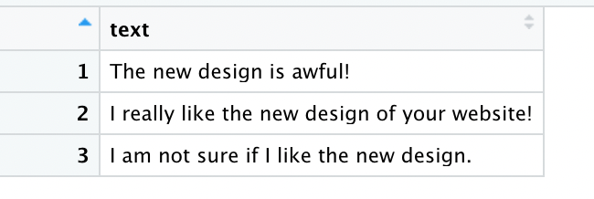
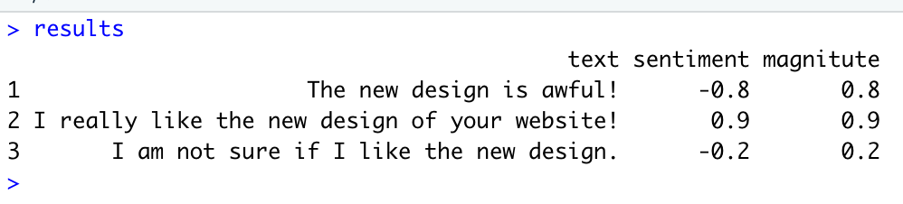

# 소개
Google Cloud Natural Language 중에서 sentiment analysis를 R에서 손쉽게 할 수 있도록 도와주는 패키지입니다.
연구목적, 개인목적으로 만들었습니다.
실행 시 문제들 책임지지 않으니 소스 코드 참고해서 알아서 해결하시기를 ㅋㅋㅋ 
Anaconda에 의존하지 않고 reticulate에서 miniconda를 받아서 설치를 마치는 방법으로 설명하겠습니다. Mac에서 R을 두번 깔려니까 귀찮아서...

# 설치하기
## reticulate
먼저 reticulate를 R에 설치합니다. 이후 설명은 Mac을 기준으로 하겠습니다. 윈도우 사용자는 별도로 설명을 합니다.

```
install.packages("reticulate")
library(reticulate)
```  

이제 miniconda를 설치합니다. 

```
install_miniconda()
```

메시지를 잘 읽어보면 r-reticulate 환경을 생성했다고 나옵니다. 이제 환경을 선택하고 google-cloud-language를 설치합니다.

```
use_condaenv('r-reticulate')
py_install('google-cloud-language',pip=TRUE)
```

## Google Application Credential 

https://cloud.google.com/sdk/gcloud <-gcloud를 먼저 컴퓨터에 설치하도록 합니다. 이편이 가장 속편합니다. 아니면 Google Cloud Console에 가서 인증 파일을 다운로드 받고 컴퓨터 인증을 수행합니다. gcloud를 설치했다는 가정 하에 설명을 진행합니다.

이제 터미널을 열어 줍니다. 터미널에서 다음 명령을 실행합니다.

```
me@mycom$ gcloud auto application-default login 
```

로그인 창이 뜨면 로그인하시면 됩니다. 자동으로 export 수행되어 GOOGLE_APPLICATION_CREDENTIALS가 경로로 잡힙니다. printenv 로 확인해봅시다(Mac).

## GoogleSentiment 설치하기

이제 Github에서 GoogleSentiment를 설치합니다.

```
remotes::install_github('drtagkim/Lab/R/GoogleSentiment',build_vignettes=TRUE)
```

# 실행
R에서 연습해봅시다.

```
> library(GoogleSentiment)
> google <- google_env()
> sample_text='좀 이르지만 디자인이 예뻐서 주문했어요. 받아보니 곳곳에 있는 글귀가 더 마음에 듭니다. ㅎㅎㅎ 하루 하루 열심히 살아야겠다는 생각이 들게 해요. 아주아주 맘에듬!'
> result <- request_sentiment_result(google,sample_text)
> analyze_sentiment(result)
[1] 0.6
> analyze_magnitude(result)
[1] 2.7
```
## CSV 파일에 데이터가 있을 때

만약 ~/Document/sample_sentiment.csv 파일을 사용한다면



```
#
library(GoogleSentiment)
install.packages("readr") #if you don't have...
#
google <- google_env()
# read a text file.
my_text <- readr::read_csv("~/Documents/sample_sentiment.csv")
# run Google API
test <- sapply(my_text$text,function(x){request_sentiment_result(google,x)})
# extract sentiment values and magnitute values
sentiment <- unlist(lapply(test,function(x){analyze_sentiment(x)}))
magnitute <- unlist(lapply(test,function(x){analyze_magnitude(x)}))
names(sentiment)=names(magnitute)=NULL
# combine results
results<-data.frame(text=my_text$text,sentiment,magnitute)
# save it if you need
# readr::write_csv(results,"output.csv")
# memory free
rm(test,sentiment,magnitute)
# rm(my_text,results)
```



## 추가
```
request_entity_result()
analyze_entities()
```
