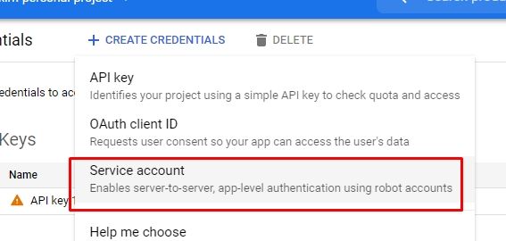

```{r setup, include = FALSE}
knitr::opts_chunk$set(
  collapse = TRUE,
  comment = "#>"
)
```

# 시작하기

## 환경 설정

### 프로그램
다음 사항을 체크해야 한다.

1. Anaconda 설치
1. reticulate 설치
1. Anaconda의 환경에서 r-reticulate 존재 확인

### google-cloud-language 설치

1. Anaconda 콘솔로 간다.(base)
1. activate r-reticulate
1. pip install google-cloud-language

## Google에서 서비스 키 만들기


Service account 선택한다. Project의 역할을 owner로 하고 JSON 파일을 다운로드.




## Path 설정

JSON파일을 적당한 위치에 저장하고 .json 파일을 다음과 같이 PATH 설정한다.

```
$env:GOOGLE_APPLICATION_CREDENTIALS="C:\Users\username\Downloads\my-key.json"
```

## 간단한 사용법

먼저 GoogleSentiment를 불러온다.

```{r,eval=FALSE}
library(GoogleSentiment)

```

샘플 텍스트를 입력한다.

```{r,eval=FALSE}
sample_text='좀 이르지만 디자인이 예뻐서 주문했어요. 
  받아보니 곳곳에 있는 글귀가 더 마음에 듭니다. ㅎㅎㅎ 
   하루 하루 열심히 살아야겠다는 생각이 들게 해요. 아주아주 맘에듬!'
```


구글 환경 설정기를 만든다.

```{r,eval=FALSE}
google <- google_env()
```

구글 환경 설정기(google)과 입력값(sample_text)로 Google Natural Language API를 실행한다. Sentiment 분석이 완료되고 result에 저장된다.

```{r,eval=FALSE}
result <- request_sentiment_result(google,sample_text)
```

감정 분석의 결과(-:negative, +:positive, 범위는 -1에서 1까지)

```
> analyze_sentiment(result)
[1] 2.7
```

감정 분석의 강도

```
> analyze_magnitude(result)
[1] 0.6
```

감정분석의 상세한 내용을 확인하기

```
> analyze_sentences(result)
# A tibble: 4 x 3
  score magnitude text                                                  
  <dbl>     <dbl> <chr>                                                 
1 0         0     좀 이르지만 디자인이 예뻐서 주문했어요.               
2 0.900     0.900 받아보니 곳곳에 있는 글귀가 더 마음에 듭니다.         
3 0.700     0.700 ㅎㅎㅎ 하루 하루 열심히 살아야겠다는 생각이 들게 해요.
4 0.900     0.900 아주아주 맘에듬!   
```
