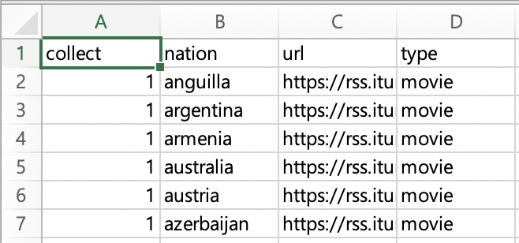
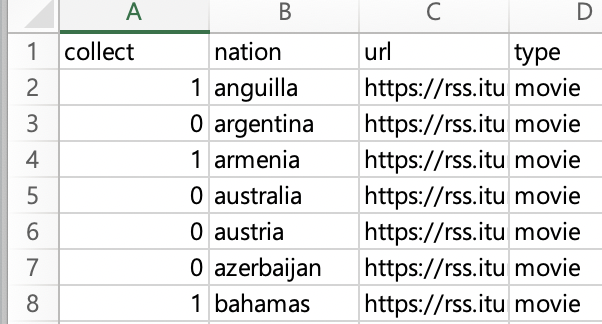

# Introduction

Maintainer: Taekyung Kim, PhD., Associate Professor, Kwangwoon University

Collaborator: Dongwon Lee, PhD., Professor, Korea University

# Install

## R

Install R: R>=4.0.3

## How to Install RiTunesStreamRank

Make sure that you have installed the latest R(>=4.0.3) and the following packages: dplyr, jsonlite,purrr,RSQLite, and DBI. If you do not have those, execute the following codes to install dependenceis:

    install.packages("dplyr")
    install.packages("jsonlite")
    install.packages("purrr")
    install.packages("RSQLite")
    install.packages("DBI")
    
To install RiTunesStreamRank, run the following:

    remotes::install_github("drtagkim/Lab/R/RiTunesStreamRank")
    
# Code Example

    library(RiTunesStreamRank)
    run_to_sqlite('testitunes.db')
    # ... in case that you want to use an input template file:
    # ... see also the following section for more information.
    run_to_sqlite('testitunes.db','your_input_template.csv')
    
If you need more information, run the following in R Console:

    ?run_to_sqlite
    
## Input template    
You can create your own data collection scenario by modifying an input template file.
To use it, first you need to create an template CSV file.

    library(RiTunesStreamRank)
    get_input_template('your_input_template.csv')
    
Open the file and find 'collect'. If value is 1, the target item will be included in your output. If the value is 0, the target item will not be.

*Template file*

*Template file with 0s*

## SQLite3

RiTunesStreamRank exports data into an SQLite3 file. If you need more information about SQLite3, visit the following sites.

* [SQLite3 home](https://www.sqlite.org/index.html)
* [W3School SQL tutorial](https://www.w3schools.com/sql/default.asp)
* [Tutorial Point - SQLite3](http://www.tutorialspoint.com/sqlite/)

## HeidiSQL

HeidiSQL Version 11 supports SQLite3. This wonderful sQL workbench helps you mimimize efforts and save time. Vist the following site to download the software and find useful resources.

https://www.heidisql.com/
